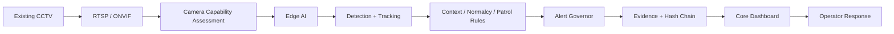
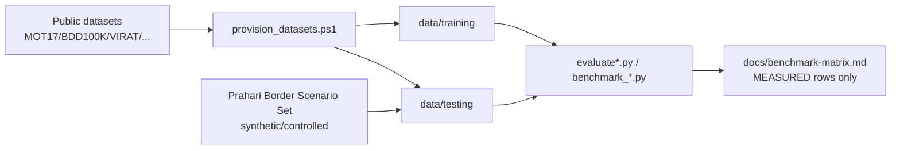
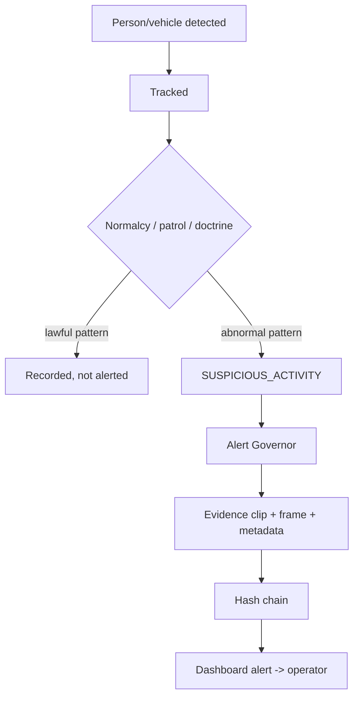
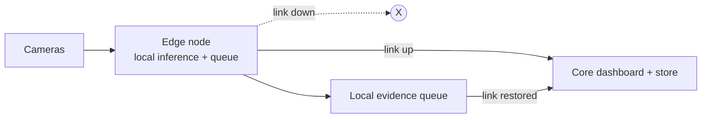

# Diagram Spec

Each diagram is exported to a `.png` (not committed) for the deck. Author them
from the descriptions below — keep them faithful to
[`../../docs/architecture.md`](../../docs/architecture.md). Mermaid sources are
included so the diagrams regenerate identically.

## architecture.png — end-to-end pipeline

## data-pipeline.png — data provenance flow

## alert-lifecycle.png — from detection to governed alert

## deployment-topology.png — edge + core + connectivity failure

## benchmark-results.png — measured evidence

Render this **only** from the MEASURED rows of
[`../../docs/benchmark-matrix.md`](../../docs/benchmark-matrix.md). Do not include
PENDING capabilities as if they were results. Suggested bars: MOT17 throughput
(12.6 fps), MOTA 0.403, IDF1 0.500, Re-ID Rank-1 0.705 / mAP 0.485, alert
suppression 71–97%, profiling error 0.2–2.2%.
